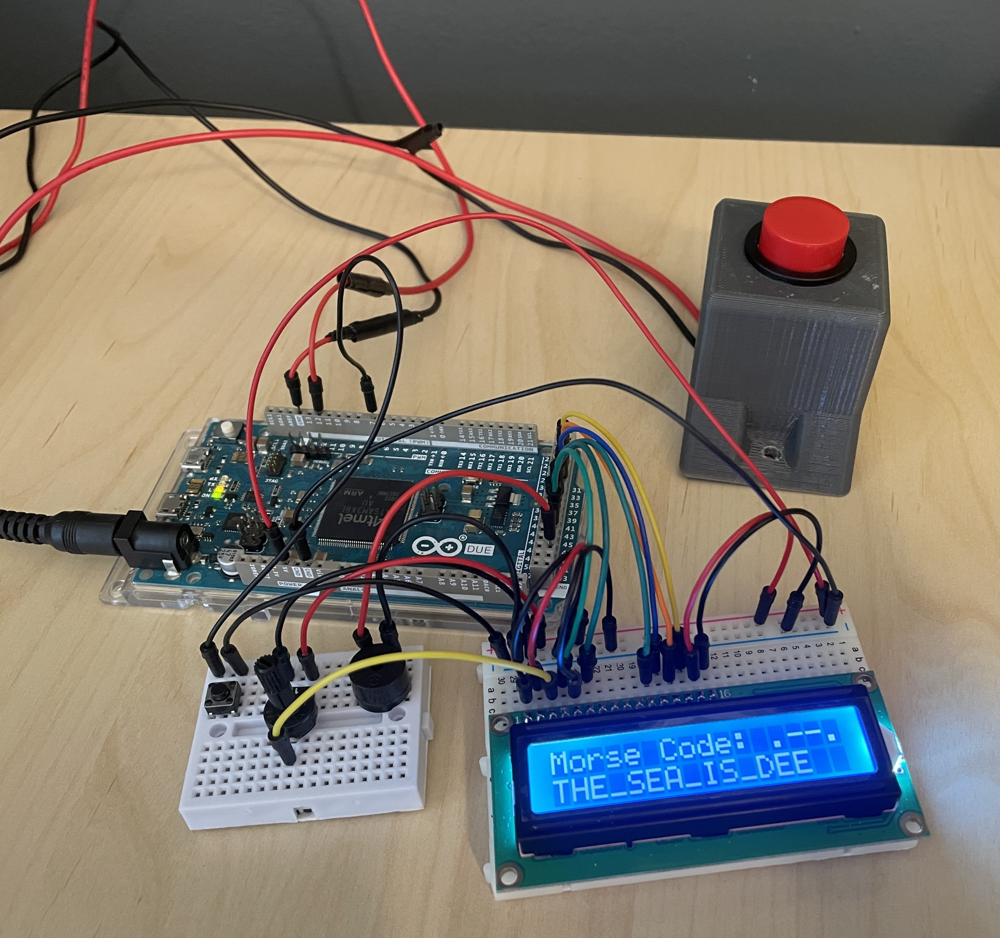
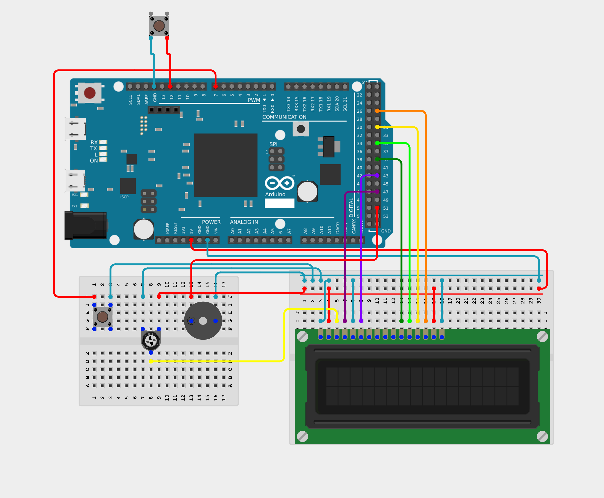

  <h1>Electronic Morse Code Decoder</h1>

## Description
The Electronic Morse Code Decoder is an embedded systems project that uses an Arduino Due, LCD, push buttons, and buzzer to create a Morse code system that displays letters and their Morse code input on the LCD. The code uses arrays to store the alphabet and corresponding Morse code, then measures the length of the button inputs to select characters and uses a buzzer to provide audio feedback.

**International Morse Code:**  
| A | B | C | D | E | F | G | H | I | J | K | L | M | N | O | P | Q | R | S | T | U | V | W | X | Y | Z |
| --- | --- | --- | --- | --- | --- | --- | --- | --- | --- | --- | --- | --- | --- | --- | --- | --- | --- | --- | --- | --- | --- | --- | --- | --- | --- |
| .- | -... | -.-. | -.. | . | ..-. | --. | .... | .. | .--- | -.- | .-.. | -- | -. | --- | .--. | --.- | .-. | ... | - | ..- | ...- | .-- | -..- | -.-- | --.. |

## Parts
- Arduino DUE (1x) [[Buy](https://store.arduino.cc/products/arduino-due?_su_rec=P52S7puitrxi2NiPlyMu0O1ZqSe1HEgDTXVc0ufymlwZE4qImo1EKuilDWeIf1GcZGFLw5S3r0fhDmIVJBg16WiqqZWBG2Gwb_nscC-kRRmf-OTwiumlbkcUF6bmII-6hWSiDEFVDeBP1rc1Z6GmXJ9YWIJf2pBYdWd0ZxVHnggykR0e0waHy-IhaWtLkZGdzLZX6gGYUtd_nWagpV8KBgrfaeLKOpAvHcqPGTSf1TH7FpH4Glc_h6mrO-VN&_su_rec_id=4839a77e-c298-444b-89f6-214208d6eb6e-1786890684)]
- 1602A LCD Display Module (16 x 2) (1x) [[Buy](https://www.amazon.com/Backlight-Characters-Interface-Pre-Soldered-Compatible/dp/B0G5NDCKP7?crid=M5WHRTMHL1B7&dib=eyJ2IjoiMSJ9.25d0pPuL0Wi9nMKD3P8wiQHS8EI-3rGABHnaCQUtfvHq6yIh9AXzQtlXvFN4J2lXVNxQ4HM3H2AFyDMV1tvfweVp5sxSyqlowA_CywT4oGsDTZOEhFnfjNHznTBtvXMcoaHrYko-_d68fJlfTtL1S2Umz5konEK0-NOe8fem_Oocyb0hOYFnmKpbRs3eM2PWyOi_rpZ0lg13mLMRroHbNoO3vkaKqkoRjcqqmWXR7I.VEnCgZsJ6fnYhN5MSVT1TV5atHAi89ILgb_JueyCYCU&dib)]
- Mini Breadboard (1x) [[Buy](https://www.amazon.com/PATIKIL-Breadboard-Solderless-Prototype-Electronics/dp/B0DBDP568C?crid=2NKRCPV22DA5L&dib=eyJ2IjoiMSJ9.dufGLUwPPHwtwQRK5n8GRdvGYxGAUGhCqiyNLDMX9AlM4ziSXt6xRmKzez0xv4pqd7BA9bDrod5NlSVzSE_BejTvPP2meKjSr8bDV5CyJqJ39dKkBZRnoGOsKd4QfASZeDcDqNZ4b7XPYamU7LwXSgMc6xIueJS1voHO2ZVRgzCFAY1V2wu-cmphSJrIGKgAECMDBgnWEh1vbyrflDseoD4NOk7F_TSsMA-cs_DjSQs.AyFRPLe_giW2rMZwM9wIMtnI8QqqBp5hp5Q5Fl-qyBY&dib)]
- Small Breadboard (1x) [[Buy](https://www.amazon.com/ELEGOO-Breadboard-Solderless-Breadboards-Electronics/dp/B0CYPVMK9J?crid=1D6JN2ZATQRQ2&dib=eyJ2IjoiMSJ9.5Z5yTwL-oa1r18Ah_zf9OWnPP1EWGXjqa8A1lKt46eoKM3XeT9pFZa5bacuOBgcxJW1MUR90VLfP2XCpwQqpPNmVrTMWzf1-igibuVepLgPAxX2PiVSFZO2-w5OovPZfhOxF8PeU3-MlR_uxOQbjvFOK41pyv6umkBHy5-IXM8tOSoSxrzhb4EHCXaTfUZY1QUYCUawXYkgPSVnC1U8Gp2-9O0ckb8ncwJ0pbb88XVM._b8ekU8SbFYLgjce7omKlHB9xf7HLkFj-Z76JiwC2xI&dib)]
- Momentary Button with Male Connection (2x) [[Buy](https://www.amazon.com/Momentary-pre-Wiring-Waterproof-Stainless-Normally/dp/B09BKXT1J1?crid=21J70PXVE1J5W&dib=eyJ2IjoiMSJ9.Jw97oCm4OBBl9lm-p-CJbyie2or7tQDNEXD4-UNJmkGUKYU7xFOoXhEn6KON6liQ8vsQtR8r3FD8SMgEij_f0MAMPVHsR23StLxB2NSA0Q8prZFSxydhK201U2cdATIubMNlRFYz5Vn1jF2AYFWFw1MlF4khAX5xASi7lJMXGFoljpAbzXB96mOQlfcDBx1-r6Vnb_n24raC2S1wfesbjc3bTDjc8d5ZCJkqn81u0co.eydqmbASvPkW8J9MmWaMVCO1iOyCZPL8G2wwx70KQF8&dib)]
- Potentiometer (10k) [[Buy](https://www.amazon.com/Potentiometer-Breadboard-Resistors-Assortment-Compatible/dp/B09G9TBY38?crid=3CWQDCX9FGXNE&dib=eyJ2IjoiMSJ9.o7rDqGDww1pTL6f30oFBhFY3o8UUx1HVj5mRBr1CCLce67PBF7eE11VX0u0yumpMNAHansdapm1v2mymhv_1-srsC8cVaM4a4CHupChub00gdY8edSKIyVVKqHX2CNmUSmWUV3dgSAsHLIhtx4hqcoU-yQOIaO6kuWCN8BV6WpHVUnsub4es6iFof4FghTNovJ6MlayOlf6dgKJo_Sub89UNcXoqB_z4sjW5wpG6r3w.X9eY696-35glsrlKh5Q-RnvmdKQKR3ag29FPCVdxbWE&dib)]
- Passive Buzzer [[Buy](https://www.amazon.com/Passive-Resistance-Electronic-Magnetic-Continuous/dp/B0F1KFHSNK?crid=1G1DMGDDC26JY&dib=eyJ2IjoiMSJ9.ZJQ5xE0Z8ueatGkFGU5fI6d88YkyEKU7SZBEg4DA7WsgtWA_Ky1XBo7ekPItK6NkJXvgh8IK2URKSwA7atORI1pLcMP4EHDZuqw3DFWITo9EaXRBfZRiJhIuAm9Xkhh3YYLmMfbYyCCs77Q443fr_7LoqD5ukcRcSMUrfakejYXxSxYJh_q9EuOwU8OQnURkQ9XbXw2LPmmtP1bLXYbk3GvDsHT5SDF3W8kBHt2-_rE.3Ln5Txxnh_25YYcc0LKyhDPvI1HAnlZBa_wqBkFhAVM&dib)]
- Male to Male Jump Wire (22x) [[Buy](https://www.amazon.com/California-JOS-Breadboard-Optional-Multicolored/dp/B0BRTJQZRD?crid=1CE9IAJVC5F83&dib=eyJ2IjoiMSJ9.urRUqWt0ag6Vi-qn73oEAiTVhJ7Ox6lj4pHdXPhv6UOpdqkYyqJkNQoT_-RYRf636PiLxOTLbkKCJXtiU_Rp-AwAgSDVMq1C0-2dluCBmDQliNHXPqkFp6lRMd83697I68qoqpZrmvA3a_ajq3sr8E-wzo6iaf5dJkEqkA4aQq65HXMRfwvB5CAatTTB_DX_y-rRtoX652DcNEuI1fELNnEtHIz7yShKeNfW2QQZeWo.rnJUxR7MPI3vANhPBxKIi7CxpxivCuaaFlL5IvCe9nQ&dib)]
- USB A to USB Micro (1x) (For Power and Programming) [[Buy](https://www.amazon.com/Micro-Cable-Arduino-Charging-Supply/dp/B0837TN6VM?crid=1CGHQYDZ1XEPA&dib=eyJ2IjoiMSJ9.U7oHVUyshD0WWytvinFZx_SU3SgccvkcE0lk7SXYK7yIcNb-puuPCsa2kmeg_IrSuju7YX0crN0DE8oIA11ooXOdDBmzsGRP28dgEYbVlccOodayMj0bmZUOaKhpvxcnLTxy66dDi3ILovIo6R3cuBHLBPlurz90l5WQIJviNPD-yS0AzYldkPe9xeXSDptj3SWyLF5C8jHrID-OSjXqzJq5gomQP7p-yuOGitqhgu0.xeLlLn9PTzxo2oz3mW6vwhEEI2uofSve3chDcIyC5eg&dib)]
- 9V AC to DC Power Adapter (1x) (For Power) [[Buy](https://www.amazon.com/ELEGOO-100V-240V-Converter-Adapter-Certificate/dp/B074BRR5YN?crid=3OR952BCZO2J&dib=eyJ2IjoiMSJ9.jB3LWBRNehrS065thaiyy_QqEE045F8Zzku69mz79fIZBAarJ49c1VUI3pkoB8KTxtCewmegSVu0P79yGfmPZbh6SOmYY03h3z786oSB73zlbBDeV7JY8uvwDuQZD4No-oEAzKRlRB1mB8NfdbibGFD0hpMlPoVNg1Xr-aU-yuIX0c3X2Z89Uxak0OMfUDQtsLmIq7-x4fPDEZZa1LIYLK7ROrS-7PjBHBikOGROZXo.84dy1MdLqv96LW7dQH4cSBN3IfTUW4lnDQJz0sA7Ksw&dib)]

3D Printed Parts:
- Momentary Button with Male Connection Case (1x) [[Print](https://www.thingiverse.com/thing:7379258)]

## Wiring Diagram

Note: The pin locations may vary from component to component, so be sure to double-check the pins are wired to the correct spot.

## Simulation Algorithms

The project has two distinct visual physics algorithms to manipulate the 8x8 LED grid based on the tilt angle ($\theta$) received from the MPU-6050 IMU. Before starting the simulation, the program will allow the user to choose which algorithm to use.

1. Particle Matrix Simulation (`particle_matrix_simulate`) This algorithm approach treats every illuminated pixel as an individual particle of sand subject to gravity.

* **Gravity Vector:** The tilt angle is translated into individual horizontal and vertical components of force using sine and cosine functions in radians:
  $$F_x = \sin(\theta), \quad F_y = \cos(\theta)$$
* **Coordinate Surrounding Mapping:** The function scans the grid to find active pixels (`1`). For each active pixel, it evaluates all 8 immediate neighboring spaces $(k, l)$ where $k, l \in \{-1, 0, 1\}$.
* **Neighboring Score:** If a neighboring cell is empty (`0`), the algorithm calculates a gravitational weight score for that vacancy:
  $$Score = (l \times F_x) + (k \times F_y)$$
* **Particle Displacement:** The particle shifts into the adjacent empty spot that yields the highest positive score. If no empty space aligns with the downward pull of gravity, the particle remains stationary.
* **Performance:** Particles dynamically stack, roll over one another, and settle into corners based on individual localized logic. The drawback of this algorithm is the mass, inertia and downward pressure of each particle are not taken into account, making the matrix appear "clunky" and not visualy smooth.

2. Line Matrix Simulation (`line_matrix_simulate`) This algorithm approach illuminates particles under a line that tilts dynamically across the matrix. 

* **Line Calculation:** The algorithm converts the angle from degrees to radians and calculates the tangent slope ($$m = \tan(\theta)$$) of the dividing line.
* **Coordinate Mapping:** It iterates through every coordinate $(i, j)$ on the 8x8 grid. For each column ($i$), it maps a $Y$-intercept ($line\_y$) relative to the center of the display:
  $$line\_y = m \times (i - 4) + 3.5$$
* **LED Illumination:** LEDs are illuminated selectively depending on whether the row index ($j$) falls above or below the calculated line boundary. The behavior splits at $\pm90^\circ$ to handle full inversions cleanly.
* **Performance:** It clears and redraws the mathematical state of the screen from scratch every frame. The accuracy of this method is very responsive, and the visual looks fluid. The drawback of this algorithm is that there is not a constant amount of dots illuminated depending on the angle.
